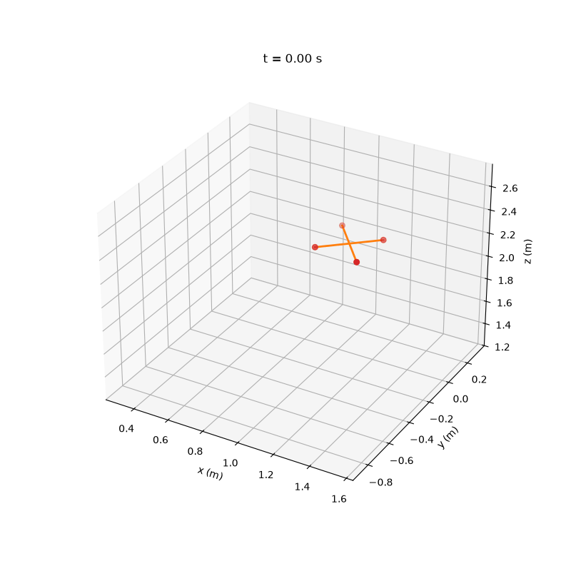

# Quad-Rotor-Flight-Control
Using RL for Quadcopter flight control. Iterative approach with my own implementation of a MDP.



*A trained PPO policy recovering from an off-center spawn and settling into
hover, rendered with `viz/generate_animation.py` — see
[docs/trajectory_visualization.md](docs/trajectory_visualization.md).*

## Status

**Stage 0: complete.** A custom 6-DOF rigid-body quadrotor dynamics model
(quaternion state, RK4 integration) is wrapped in a Gymnasium hover-task
environment, and a PPO baseline demonstrably learns to hover: it converges
to within ~1cm of the target position and holds it, with smooth
(non-bang-bang) motor commands and a plateaued reward curve. See
[prompts/Stage0 prompts](prompts/Stage0%20prompts.md) for the stage roadmap.

**Stage 1: complete.** Infrastructure for everything Stage 2+ needs, with
no behavior change to the Stage 0 baseline unless a new seam is
deliberately turned on:

- **Config** (`quad_rl/config/`): hierarchical, validated, overridable
  YAML. `configs/base.yaml` (physics/simulation) + `configs/hover.yaml`
  (episode/reward/spawn/disturbance/randomization, inherits base) +
  `configs/default.yaml` (alias to hover.yaml). Dotted `key=value`
  overrides on the CLI. Every config section is a validated dataclass
  that round-trips through `asdict()`, so a run's exact config is dumped
  to `runs/<name>/config.yaml` for reproducibility.
- **Pluggable reward terms** (`quad_rl/envs/rewards.py`): reward is a
  `REWARD_REGISTRY` of composable term classes summed by a
  `RewardFunction`, not a hardcoded formula — config becomes a `terms:`
  list, so Stage 2's reward shaping is a config change.
- **Disturbance seam** (`quad_rl/envs/disturbances.py`): pluggable wind
  force and observation noise, registered the same way as reward terms.
  Defaults to `none`/`none` (bit-identical to no disturbance); Stage 2
  turns it on via config.
- **Domain randomization + privileged observation**
  (`quad_rl/envs/randomization.py`): per-episode physics parameter
  sampling (`Uniform`/`LogUniform`/`Fixed`, addressed by dotted path into
  `PhysicsConfig`) and an `expose_privileged` flag that adds a
  `privileged_obs` observation block carrying the sampled parameters —
  the seam three different domain-adaptation strategies can build on
  (RMA two-phase, randomization-only, explicit system ID; see
  [docs/domain_adaptation.md](docs/domain_adaptation.md)).
- **Observation history**: `history_length` config field stacks the last
  N observations at the env level (survives an eventual move away from
  SB3, unlike `VecFrameStack`).
- **Algorithm-agnostic training** (`quad_rl/training/train.py` +
  `algorithms.py`): PPO, SAC, and TD3 are all one `--algo` flag away, via
  an `ALGO_REGISTRY` of `AlgoSpec`s rather than a PPO-only script.
- **Evaluation harness** (`quad_rl/training/evaluate.py`): aggregate
  metrics (success rate, crash rate, terminal position error, action
  smoothness) over N episodes, not just a single plot; `--eval-env-config`
  makes a sim-to-sim generalization check one flag.
- **Full env test suite** (`quad_rl/tests/test_env.py`): `check_env`,
  determinism, every crash condition, truncation timing, and a
  registry/config drift check.

`train_ppo.py`/`eval_rollout.py` still work exactly as before (thin,
deprecated shims forwarding to `train.py`/`evaluate.py`) — see
[DEVELOPER.md](DEVELOPER.md) for the full command reference and
technical details.

Next: Stage 2 (turning these seams on — reward shaping, wind/sensor-noise
disturbance, domain randomization).

## Project structure

```
quad_rl/
  config/
    loader.py           # YAML defaults: inheritance + dotted-override loading
    schema.py            # validated config dataclasses (PhysicsConfig, EnvConfig, ...)
  envs/
    dynamics.py          # rigid-body equations of motion, RK4 integrator
    quad_hover_env.py     # Gymnasium Env wrapping dynamics.py, registers "QuadHover-v0"
    rewards.py            # pluggable reward terms + REWARD_REGISTRY
    disturbances.py       # pluggable wind force / observation noise + registries
    randomization.py      # per-episode physics parameter sampling (ParameterSampler)
    configs/
      base.yaml            # physics + simulation
      hover.yaml            # episode, reward, spawn, disturbance, randomization (inherits base)
      default.yaml          # alias for hover.yaml (backward compat)
  training/
    train.py              # algorithm-agnostic training entrypoint (--algo ppo/sac/td3)
    algorithms.py           # ALGO_REGISTRY: SB3 class + hyperparams + policy per algo
    callbacks.py             # HoverFractionCallback, EpisodeMetricsCallback
    evaluate.py               # multi-episode evaluation harness + aggregate metrics
    train_ppo.py               # deprecated shim -> train.py --algo ppo
    eval_rollout.py             # deprecated shim -> evaluate.py --n-episodes 1
    configs/algo/
      ppo.yaml, sac.yaml, td3.yaml   # per-algorithm hyperparameters
  tests/
    test_config.py, test_dynamics.py, test_rewards.py, test_disturbances.py,
    test_randomization.py, test_env.py, test_algorithms.py, test_train.py,
    test_evaluate.py
viz/
  recorder.py            # TrajectoryRecorder(gym.Wrapper): logs position/quaternion/time to .npz
  animate.py              # python -m viz.animate: renders a .npz to a 3D .mp4/.gif animation
  generate_animation.py    # python -m viz.generate_animation: record + render in one command
  tests/
    test_recorder.py
docs/
  domain_adaptation.md   # RMA / randomization-only / system-ID sketch (Stage 1.4)
  trajectory_visualization.md   # how to record + render + view a 3D rollout animation
requirements.txt
```

## Setup

Requires Python 3.10+ (developed against 3.14).

```bash
python3 -m venv .venv
source .venv/bin/activate
pip install -r requirements.txt
```

Verify the install:

```bash
python -c "import gymnasium, stable_baselines3; print(gymnasium.__version__, stable_baselines3.__version__)"
```

## Quick start

```bash
# Full test suite
pytest quad_rl/tests/ -v

# Train (see DEVELOPER.md for all options, config inheritance, and the registries)
python -m quad_rl.training.train --algo ppo --total-timesteps 3000000 --run-name my_run

# Watch progress
tensorboard --logdir runs/tensorboard

# Evaluate a checkpoint over N episodes (--algo is read back from the run's
# own config.yaml automatically -- no need to pass it again)
python -m quad_rl.training.evaluate --checkpoint runs/my_run/final_model.zip --n-episodes 20

# Visualize a rollout in 3D -- record + render in one command
# (see docs/trajectory_visualization.md)
python -m viz.generate_animation --out rollout.mp4
```

For the full command reference, config file layout, the reward/disturbance/
algorithm registries, and project conventions, see [DEVELOPER.md](DEVELOPER.md).
For recording and rendering a 3D rollout animation, see
[docs/trajectory_visualization.md](docs/trajectory_visualization.md).
